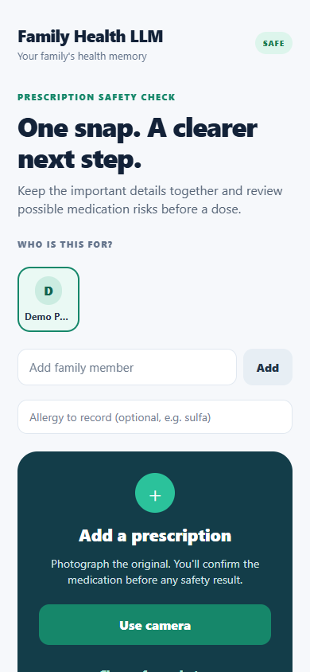
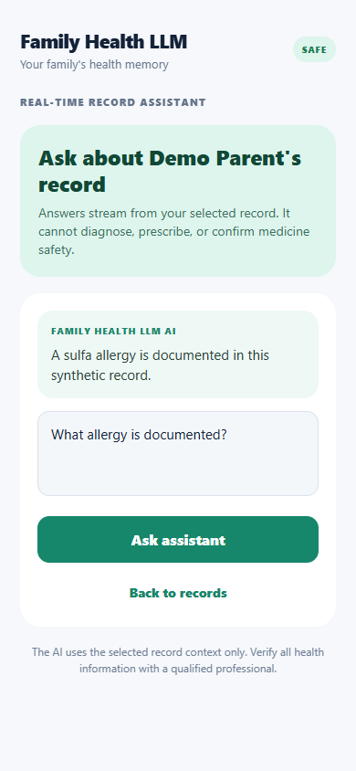
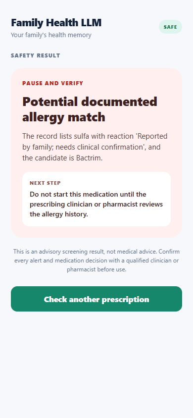

# Family Health LLM

Family Health LLM is a privacy-conscious health-record MVP for families. It turns a prescription into structured medication candidates and explainable clinical-safety alerts. It is **advisory software, not a medical device or replacement for a clinician**.

Repository: [`Charan-Hari/Family-Health-LLM`](https://github.com/Charan-Hari/Family-Health-LLM)

## Repository layout

- `apps/api` - FastAPI service, local persistence, extraction stub, and safety engine.
- `apps/mobile` - Expo React Native app for the prescription-to-alert workflow.
- `infra` - Optional local PostgreSQL, Neo4j, and Qdrant services.
- `docs` - Product, clinical safety, graph, UX, operations, and deployment specifications.

## Quick start

Prerequisites: Python 3.12+ and Node.js 20+.

```powershell
cd C:\path\to\Family-Health-LLM\apps\api
python -m venv .venv
.\.venv\Scripts\Activate.ps1
python -m pip install --upgrade pip
python -m pip install -e ".[dev]"
uvicorn family_health_llm.main:app --reload
```

In another terminal:

```powershell
cd C:\path\to\Family-Health-LLM\apps\mobile
npm install
npx expo start
```

Open the Expo app with Expo Go, an emulator, or the web target. For a physical device, set `EXPO_PUBLIC_API_URL` to a LAN-reachable HTTPS URL rather than `localhost`.

## Real-time AI assistant

The mobile app includes a real-time, clinician-safe record explainer backed by a **local, free Ollama model**. See [LLM setup](docs/llm-integration.md). Model services and any future provider credentials remain on the API host, never in the client.

To prepare Android/iOS builds and GitHub Actions without committing credentials, read the [mobile release guide](docs/mobile-release.md).

## Demo

All media below uses synthetic data only. It is generated locally by [`capture-demo.mjs`](apps/mobile/scripts/capture-demo.mjs); no real health record, personal identifier, API token, or prescription is included.

<p align="center">
  
  
  
</p>

<p align="center">
  
</p>

## Automation and MCP tools

- **CI** runs API lint/tests and a mobile type check on pushes and pull requests.
- **Deploy web client** is a manual GitHub Actions workflow that publishes the Expo web build to GitHub Pages.
- **Build mobile preview** is a manual GitHub Actions workflow that creates an EAS Android preview APK. It needs the `EXPO_TOKEN` GitHub Secret and `PUBLIC_API_URL` GitHub Variable; neither belongs in the repository.
- A local stdio MCP server exposes narrowly scoped record-explaining and safety-screening tools for development only. See [MCP server setup](docs/mcp-server.md).

## Safety and privacy

- Do not put medical records, API keys, passwords, or personal email addresses in this repository.
- The local API uses SQLite only for development; its development database is ignored by Git.
- Every safety result requires clinical confirmation before medication use.
- Before collecting real health data, complete threat modeling, consent flows, authentication, encryption/key management, audit review, clinical validation, and legal/compliance review.

See [deployment guidance](docs/deployment.md), [clinical safety scope](docs/drug-interaction-engine.md), and the [product requirements](docs/prd.md).
